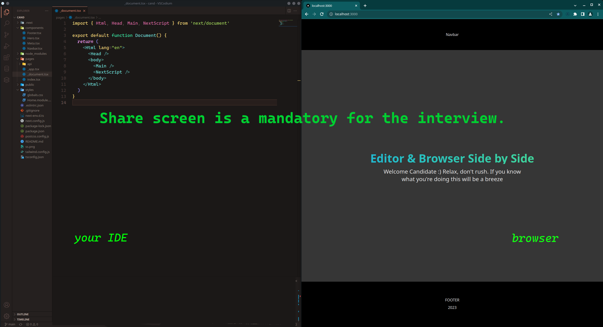

### Welcome to the Candidate Application

This repository is a sandbox for future developers that applied for the front-end developer position at Boho Agency INC.

## Getting Started

These instructions will help you understand better what's ahead of you!

### Required Knowledge

1. TypeScript
2. Nextjs
3. GraphQL/REST API
4. Styling Framework any of (Bootstrap, Tailwind, Chakra, Mantine)

### Prerequisites

1. Node Installed
2. Git Installed
3. Browser Installed

### Installing

1. Please clone the repositiory
2. Navigate to the cloned folder

3. Install dependencies

```
npm install
```

4. Run the application

```
npm run dev
```

5. Open the 'dev server' in your browser http:localhost:3000/

### Interview Prerequises


1. Camera, we'd like to see with whom are we going to work (must!)
2. Sharing Screen is mandatory during the short coding interview.
3. Code editor on one side and browser on the other.

_Importance:_ Visual indentification is important to us. Minors are applying for jobs etc. We will call you with a video enabled.

4. Example Screen during the interview



### About Interview Questions and Test itself

a) **Verbal questions** - You will be asked simple frontend developer questions - Example: What is Footer ?

_Importance_ filtering out the middleman and people that don't know how to code

b) **Coding Interview and Search Engine Usage**
There will be 4 tasks ahead of you. Don't worry this is not 'leetcode' or 'adventcode'. So please relax
There are no algorithms on this interview. 

1. TASK_1 is very simple
2. TASK_2 is simple
3. TASK_3 is standard and you need to use libraries that are in the repository
4. TASK_4 is a bit more complex and you need to use extral library that will be presented to you and make it work

- You can use external resources for **TAKS 3** and **TAKS 4** (Google ✅, StackOverflow ✅, Search Engine ✅ of your choice)

- 🛑 Chat-GPT-3 IS NOT ALLOWED !! Github Copilot is not allowed! 🛑

_Importance_

1. showing live troubleshooting, tought process and live usage of Search Engines
2. filtering out candidates

### RULES

**DO NOT** use any of the libraries that are not installed in the project

- This test will show your current knowledge of Next and TypeScript
- Don't worry too much if you don't know the question try to explain it the best way you can :)

### GOOD LUCK!!!
